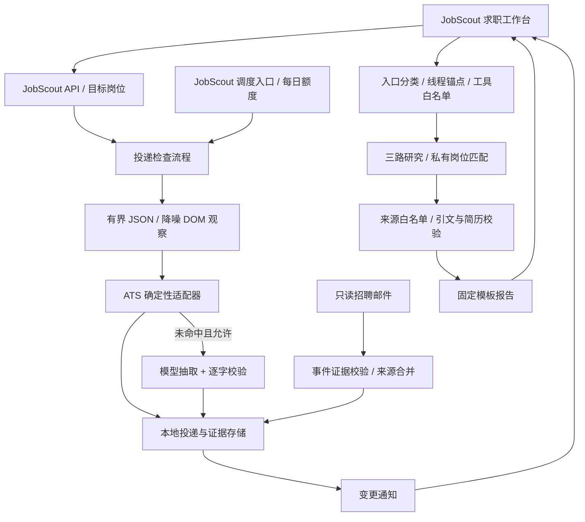

# JobScout

**把每一份投递的进度、变化和原文依据，放在一个工作台里。**

JobScout 是基于 DeerFlow 的求职应用，以投递进度追踪为主线，连接面试准备与飞书 Base 岗位匹配。它读取本人已授权的招聘页面，记录每个岗位的状态；信息不足就保留未知，发现变化就展示来源证据。

[功能与护栏](docs/jobscout/guardrails.md) · [真实指标与待验证项](docs/jobscout/metrics.md) · [上游 DeerFlow 文档](README_DEERFLOW.md)


界面截图来自完全拦截网络请求的本地浏览器 fixture，所有公司、岗位与账号均为合成数据。新版默认进入投递追踪，提供可折叠概览、环节筛选与移动端卡片视图；桌面列表支持独立滚轮滚动与固定表头，[查看手机界面](docs/jobscout/tracker-mobile.png)。

历史对话右侧的删除按钮会先确认，删除后保留目标岗位与投递记录。正在运行的对话需等任务结束再删。紧凑布局的一屏完整可见岗位数，在 1440×1000 的离线浏览器测试中从 6 条增至 11 条；测量口径见 [指标记录](docs/jobscout/metrics.md#历史删除与列表滚动优化2026-10-04)。

刷新投递时可以同时与 AI 对话，并在进度与当前对话之间切换。两项任务分别显示状态、提供停止按钮；刷新完成显示通知，点击“查看结果”查看详情。检查超时会保留此前进度；配置与取消边界见 [抓取策略](docs/jobscout/tracker-stability.md#并发取消与期限)。更新后需重启 Gateway 并刷新浏览器。

## 从投递到下一轮面试

1. **添加投递**：填写公司与个人申请列表/详情链接，复用本地登录 profile；多岗位列表按岗位分别记录。
2. **核对进展**：同站 JSON 优先、页面正文兜底，点击状态查看原文、规则置信度与检查时间。投递日期必须有原文，不猜时间。
3. **跟踪变化**：单条/批量刷新、环节筛选、手动阶段、CSV 导入导出。可配置定时刷新与每日上限，已确认状态变化进入站内通知。
4. **补充来源**：可选只读 Gmail/IMAP 招聘邮件。仅在更晚、更具体且不冲突时采用邮件状态，界面保留来源与待核对项。
5. **准备下一轮**：把投递关联到目标岗位，进入有来源的面试准备；也可上传简历与已授权飞书岗位库匹配，逐项查看简历原文依据。

邮件与定时刷新默认关闭；定时刷新默认不调用模型。普通模型研究和手动检查的模型回退可能产生费用，真实验证需使用者主动运行。

## 我的贡献

本仓库新增的 JobScout 业务能力与 DeerFlow 上游基础设施分开维护：

| JobScout 新增/改造 | 主要代码 |
|---|---|
| 投递数据模型、存储、登录复用、状态/日期证据、跨域限量刷新 | [application_tracker](backend/app/application_tracker/) |
| 飞书/字节同结构、腾讯、小红书的确定性 ATS 解析 | [adapters](backend/app/application_tracker/adapters/) |
| 只读招聘邮件、事件抽取、门户/邮件合并 | [email](backend/app/application_tracker/email/) |
| 定时刷新额度、专属调度入口、站内通知 | [scheduling.py](backend/app/application_tracker/scheduling.py) |
| 入口分类、线程锚点、按模式绑定工具、URL 白名单、结构化证据和固定模板 | [jobscout](backend/app/jobscout/) |
| 飞书只读上下文与简历逐字计分、目标岗位联动 | [JobScout Gateway](backend/app/gateway/routers/jobscout.py) |
| 独立求职工作台、流式报告、历史回放、导出与移动端 | [jobscout-web](jobscout-web/) |
| 私有快照/辅助标注、离线判分器、行为/触发评测与指标记录 | [评测与指标](docs/jobscout/metrics.md) |

DeerFlow 上游提供 Agent runtime、认证、工具与技能基础设施、持久化检查点、通用 scheduler 和原 Next.js 客户端。JobScout 复用这些能力，通过专属 assistant、应用中间件和部署开关隔离业务行为；不把上游能力计作个人新增成果。

## JobScout 架构

图中只画本项目的业务组件；运行、认证和调度底座由 DeerFlow 提供。



## 已测到什么

数字来自 [metrics.md](docs/jobscout/metrics.md)，更新于 2026-10-04。当前仅有 20 条证据明确的辅助标签，另有 2 条待核对；未达到 50–100 条目标，尚未独立人工复核。开发快照没有独立留出集，不能宣称生产准确率。

| 指标 | 实际结果 | 范围 |
|---|---:|---|
| ATS 接管率 | 15/20（75%） | 阶段 5，开发快照回放 |
| 接管内状态正确率 | 15/15（100%） | 仅已接管项，辅助标签 |
| 全集未知占比 | 5/20（25%） | 未运行模型回退 |
| 非空状态证据逐字率 | 15/15（100%） | 已接管 JSON 证据 |
| 全集投递日期正确率 | 2/20（10%） | 未确认字段不猜测 |
| 原触发集跑题漏放 / 误拒 | 0/12 / 0/12 | 24 条合成规则评测 |
| 新增上下文集跑题漏放 / 误拒 | 0/5 / 1/7 | 12 条合成规则评测 |
| 完整流程准确率、耗时、模型 token / 成本 | 待运行 | 真实模型基线与生产回退 |
| 真实邮件质量、调度成功率与通知延迟 | 待运行 | 默认未启用 |

护栏如何校验、不能保证什么，以及阶段前后对照，见 [guardrails.md](docs/jobscout/guardrails.md)。未把测试通过数当作真实业务效果。

## 本地运行

按 [上游安装说明](README_DEERFLOW.md#quick-start) 安装依赖并创建本地 `config.yaml` 与 `extensions_config.json`；这些文件不提交。在已有环境中，Windows 可运行：

```powershell
# 两个终端，仓库根目录
scripts/run-jobscout-gateway-local.cmd
scripts/run-jobscout-web-local.cmd
```

打开 **http://localhost:5500**，Gateway 默认 **http://localhost:8001**。Gateway 的 `GATEWAY_CORS_ORIGINS` 需允许 `http://localhost:5500`。本地服务绑定 `127.0.0.1`，面向可信的本机使用。

JobScout 报告需要注册应用中间件，严格线程入口需要 `JOBSCOUT_ENFORCE_THREAD_BINDING=1`；具体见 [入口配置](docs/jobscout/entry-routing.md) 与 [证据校验](docs/jobscout/evidence-guard.md)。不要省略配置后把未校验输出当作受护栏保护的报告。

- [Tracker 抓取策略与配置](docs/jobscout/tracker-stability.md)
- [ATS 范围与回放](docs/jobscout/ats-adapters.md)
- [邮件只读授权与本地凭据](docs/jobscout/mail-channel.md)
- [定时刷新、每日额度与通知](docs/jobscout/scheduled-refresh.md)
- [页面使用说明](jobscout-web/README.md)

真实页面快照、简历、邮件和逐条预测留在 gitignore 的本地目录；GitHub 只保存合成 fixture、代码及汇总指标。模型抽取启用后会将所需正文发送给配置的模型供应商。

## 离线验证

```powershell
node jobscout-web/test_pure.js
backend/.venv/Scripts/python.exe -B jobscout-web/test_ui.py
backend/.venv/Scripts/python.exe -B -m unittest discover -s skills/public/jobscout/scripts -p "test_*.py"
# 在 backend 目录运行，阻断外网并禁用本地 dotenv
.venv/Scripts/python.exe -B scripts/jobscout_offline_tests.py
```

阶段 7 的专项 pytest 为 **331 项通过**，技能 unittest **18 项通过**，前端纯函数测试通过。完整后端回归仍受既有 Windows BoxLite 权限断言及 blocking-I/O 环境失败影响；完整记录见 [metrics.md](docs/jobscout/metrics.md)。

## 上游与许可

基于 ByteDance DeerFlow，遵循 [MIT License](LICENSE)。上游 README 已原样移至 [README_DEERFLOW.md](README_DEERFLOW.md)，保留安装、架构、安全与贡献者说明；来源对应本地上游提交 `f9f3127dc144f231acae9a522edd36ffbc96e439`。
