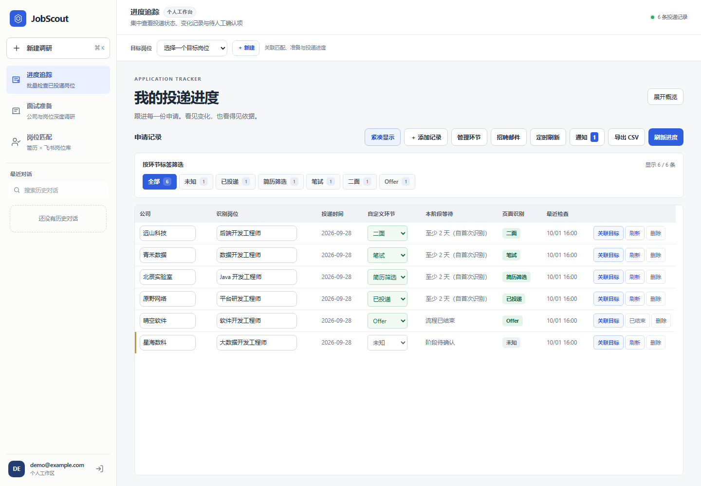
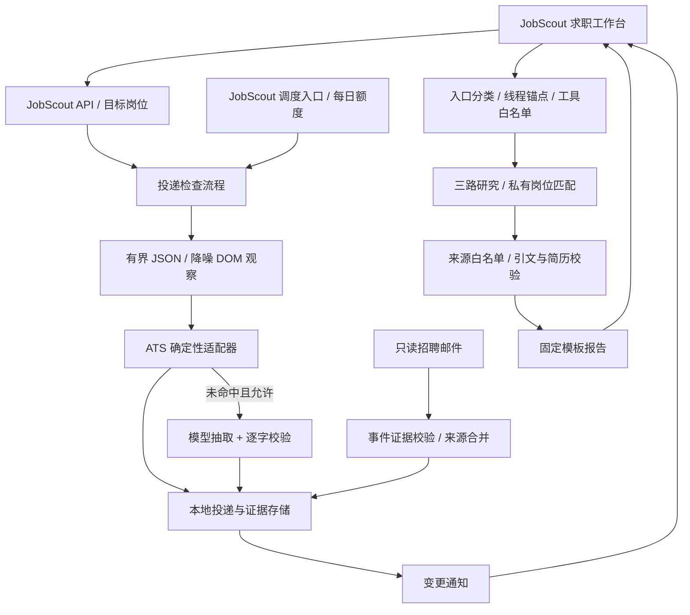

# JobScout · 把投递进度，变成清晰的下一步

**投了哪些岗位、现在走到哪一步、接下来该准备什么——在一个工作台里接着做。**

JobScout 是基于 [DeerFlow](README_DEERFLOW.md) 二次开发的 AI 求职应用。它把招聘官网的投递状态、目标岗位、面试准备和飞书岗位库连接起来：先看进展，再核对原文，最后带着岗位上下文准备下一轮。

[快速部署](#快速部署) · [功能示例](#一次具体的使用过程) · [架构与个人贡献](#我的贡献) · [部署说明](docs/jobscout/deployment.md) · [实际评测](docs/jobscout/metrics.md)



*截图来自拦截全部网络请求的本地测试；公司、岗位和账号均为合成数据。[查看手机界面](docs/jobscout/tracker-mobile.png)。*

## 一次具体的使用过程

> 以下是功能使用示例，不代表真实公司或真实投递结果。

你正在准备“远山科技 · 后端开发工程师”，同时跟进另外几家公司的笔试和面试。

1. **把投递放进来。** 添加自己在招聘官网的“我的投递”链接。如果一页里有多个岗位，JobScout 按能核对的岗位分别保存；遇到登录页，就等待你完成授权登录。
2. **看看今天变了什么。** 点击刷新。如果状态从“一面”变为“二面”，列表会展示变化；点击状态，可以看到官网原文、来源链接和检查时间，而不只是一个没有出处的标签。
3. **带着这个岗位继续准备。** 把记录关联到目标岗位，点击“准备下一轮”。岗位和当前阶段进入准备输入框，你确认后再发送；已有的准备对话也能继续。
4. **把简历和要求放在一起看。** 上传 PDF/DOCX 简历，结合 JD 进行准备；如果你有授权的飞书岗位库，还可以查看候选岗位及对应的简历原文依据。
5. **回来看时，线索还在。** 切换目标岗位会恢复对应会话；检查历史、手动修正和来源依据保留。删除一段历史对话，也不会顺手删掉目标岗位和投递记录。

面试准备可以这样开始：

```text
我准备应聘远山科技的后端开发实习生，方向是 Python / AI Agent。
这是岗位 JD 和我的简历。请整理岗位要求、相关经历差距和有依据的面试准备问题。
```

没有可靠来源的公司信息不会补写成事实；缺少可核验经历时，报告会保留信息边界。JobScout 记录和辅助准备的对象是你自己的投递，关联目标岗位不会替你提交申请。

## 能帮你完成什么

| 场景 | 你提供什么 | 工作台给你什么 |
|---|---|---|
| **集中跟进投递** | 本人的官网申请列表或详情链接 | 岗位记录、统一阶段、原文证据、检查历史与状态变化 |
| **准备下一轮面试** | 公司、岗位方向、招聘类型；可补充 JD 和简历 | 公司与岗位调研、来源明确的准备问题、简历差距与信息边界 |
| **从岗位库找方向** | 简历、已授权的飞书 Base/Wiki 链接 | 有记录标识的候选岗位、匹配依据、“保存并准备”入口 |
| **管理已有记录** | 手动整理或 CSV 导入的投递数据 | 环节筛选、单条/批量刷新、手动修正、CSV 导出和移动端卡片 |
| **补充招聘邮件** | 自行配置的只读 Gmail/IMAP 授权 | 邮件事件、来源与冲突提示；不会把模糊邮件直接当作状态确认 |
| **减少重复检查** | 自行设置刷新频率和每日额度 | 定时检查与确认变化后的站内通知；默认关闭 |

**刷新和聊天可以同时进行。** 两项任务各有状态与停止按钮；刷新完成后收到通知，你可以继续当前对话，也可以点击“查看结果”。桌面表格支持固定表头和独立滚动，窄屏改用卡片；历史对话支持搜索与确认后删除。

**状态有依据，未知也有位置。** 优先读取同站 JSON 与页面正文，已适配飞书/字节同结构、腾讯和小红书的部分 ATS 返回。适配范围是经过回放验证的具体结构，不是所有招聘网站。宽泛进度保留原话，投递日期需要明确原文，缺失或冲突项留待核对。

## 快速部署

需要 **Docker Compose v2.20+** 和 **Python 3.10+**。宿主机不需要安装前端、后端和浏览器依赖。

```bash
git clone https://github.com/Funkierry/JobScout.git
cd JobScout
python scripts/jobscout.py init
```

编辑 `.jobscout/.env` 中的三个模型参数：

```dotenv
JOBSCOUT_MODEL=你的模型标识
JOBSCOUT_MODEL_API_KEY=你的模型API密钥
JOBSCOUT_MODEL_BASE_URL=https://你的服务商/v1
```

模型需支持 OpenAI 兼容 Chat API 与工具调用。然后运行：

```bash
python scripts/jobscout.py doctor
python scripts/jobscout.py up
```

打开 **http://localhost:2026**，创建管理员账号即可进入工作台。首次构建会下载依赖并编译上游能力中心；命令会等待健康检查通过后才报告启动成功。

服务器也可以直接拉取 **按完整提交号标记的预构建镜像**，省去现场安装依赖和编译。在 `.jobscout/.env` 设置 `JOBSCOUT_DEPLOY_MODE=images` 与已发布的 `JOBSCOUT_IMAGE_TAG=sha-完整提交号`，再运行同一个 `up` 命令。镜像模式要求 Compose 2.24.4+，当前发布 `linux/amd64`；具体版本获取、访问权限和升级步骤见[镜像部署](docs/jobscout/deployment.md#使用预构建镜像)。

这套入口会为你准备：

- **独立配置目录：** `.jobscout/`，初始化不覆盖原来根目录的本地开发配置。
- **统一访问地址：** JobScout 页面、API 和飞书能力中心共用一个入口，网页不再写死 localhost 后端。
- **完整浏览器依赖：** 镜像中安装对应版本的 Chromium 与系统库。
- **持久化数据卷：** 保存账号、会话、投递、上传文件和浏览器登录态。
- **首次账号设置：** 新实例直接创建管理员；公开注册默认关闭。
- **维护命令：** 查看状态和日志、备份数据、停止与重新构建。

```bash
python scripts/jobscout.py status
python scripts/jobscout.py logs
python scripts/jobscout.py backup
python scripts/jobscout.py down
```

**部署到服务器时，招聘网站登录怎么办？** 默认无头检查遇到登录会显示“需登录”。可启用私有远程浏览器，在 SSH 隧道中完成登录/验证码，再复用保存的登录态。[完整步骤、HTTPS、备份和故障排查 →](docs/jobscout/deployment.md)

默认服务仅绑定本机回环地址，适合个人自托管或可信小范围使用。模型调研和部分解析回退可能产生服务商费用；邮件和定时刷新默认关闭。公网多人使用还需要按实际场景完善配额、浏览器会话隔离及运维能力。

## 我的贡献

### 日常使用中的可靠性

- **刷新不会把状态倒退：** 两个标签页同时刷新同一岗位时复用已完成的检查；检查途中修改公司、岗位或备注，旧结果不会覆盖修改后的记录，也不会重复生成通知。
- **CSV 可以往返导入：** 投递页提供“导入 CSV”，接受英文模板和 JobScout 自己导出的中文表头；备注保留，公式形态的内容按文本编码导出。
- **研究有调用预算：** 主研究 Agent 和子任务共用一次预算；单条投递检查中的状态提取与规划回退也共用预算。达到上限或供应商不返回用量后，停止继续调用。已发出的请求仍可能使最终用量超过阈值。
- **备份可以验证恢复：** `backup` 暂停写入后归档，`restore --archive ...` 恢复到空数据卷；CI 会演练恢复后的账号持久化。

目标岗位列表的读取合并为 3 次查询，SQLite 连接在事务结束后关闭。具体实现、验证方式与后续工作见[可靠性改进记录](docs/jobscout/reliability.md)。


本仓库新增的 JobScout 业务能力与 DeerFlow 上游基础设施分开维护：

| JobScout 新增/改造 | 主要代码 |
|---|---|
| 投递数据模型、存储、登录复用、状态/日期证据、跨域限量刷新 | [application_tracker](backend/app/application_tracker/) |
| 飞书/字节同结构、腾讯、小红书的确定性 ATS 解析 | [adapters](backend/app/application_tracker/adapters/) |
| 只读招聘邮件、事件抽取、门户/邮件合并 | [email](backend/app/application_tracker/email/) |
| 定时刷新额度、专属调度入口、站内通知 | [scheduling.py](backend/app/application_tracker/scheduling.py) |
| 入口分类、线程锚点、按模式绑定工具、URL 白名单、结构化证据和固定模板 | [jobscout](backend/app/jobscout/) |
| 飞书只读上下文与简历逐字计分、目标岗位联动 | [JobScout Gateway](backend/app/gateway/routers/jobscout.py) |
| 独立求职工作台、流式报告、历史回放、导出与移动端 | [jobscout-web](jobscout-web/) |
| 私有快照/辅助标注、离线判分器、行为/触发评测与指标记录 | [评测与指标](docs/jobscout/metrics.md) |

DeerFlow 上游提供 Agent runtime、认证、工具与技能基础设施、持久化检查点、通用 scheduler 和原 Next.js 客户端。JobScout 复用这些能力，通过专属 assistant、应用中间件和部署开关隔离业务行为；不把上游能力计作个人新增成果。

## JobScout 架构


图中只画本项目的业务组件；运行、认证和调度底座由 DeerFlow 提供。



## 已测到什么


数字来自 [metrics.md](docs/jobscout/metrics.md)，更新于 2026-10-04。当前仅有 20 条证据明确的辅助标签，另有 2 条待核对；未达到 50–100 条目标，尚未独立人工复核。开发快照没有独立留出集，不能宣称生产准确率。

| 指标 | 实际结果 | 范围 |
|---|---:|---|
| ATS 接管率 | 15/20（75%） | 阶段 5，开发快照回放 |
| 接管内状态正确率 | 15/15（100%） | 仅已接管项，辅助标签 |
| 全集未知占比 | 5/20（25%） | 未运行模型回退 |
| 非空状态证据逐字率 | 15/15（100%） | 已接管 JSON 证据 |
| 全集投递日期正确率 | 2/20（10%） | 未确认字段不猜测 |
| 原触发集跑题漏放 / 误拒 | 0/12 / 0/12 | 24 条合成规则评测 |
| 新增上下文集跑题漏放 / 误拒 | 0/5 / 1/7 | 12 条合成规则评测 |
| 完整流程准确率、耗时、模型 token / 成本 | 待运行 | 真实模型基线与生产回退 |
| 真实邮件质量、调度成功率与通知延迟 | 待运行 | 默认未启用 |

护栏如何校验、不能保证什么，以及阶段前后对照，见 [guardrails.md](docs/jobscout/guardrails.md)。未把测试通过数当作真实业务效果。

## 开发与验证

已有本地环境可以继续使用原来的两个启动入口：

```powershell
# 在仓库根目录，分别放在两个终端运行
scripts/run-jobscout-gateway-local.cmd
scripts/run-jobscout-web-local.cmd
```

打开 `http://localhost:5500`，Gateway 为 `http://localhost:8001`。依赖安装与根目录配置见[上游安装说明](README_DEERFLOW.md#quick-start)。该分离端口模式需要 `GATEWAY_CORS_ORIGINS` 包含 `http://localhost:5500`；JobScout 中间件和严格线程绑定按[入口配置](docs/jobscout/entry-routing.md)启用。Docker 专用配置已包含这些 JobScout 开关。

离线回归使用合成页面与接口，不需要真实简历、招聘账户或模型密钥：

```powershell
node jobscout-web/test_pure.js
backend/.venv/Scripts/python.exe -B jobscout-web/test_deployment.py
backend/.venv/Scripts/python.exe -B jobscout-web/test_ui.py
backend/.venv/Scripts/python.exe -B jobscout-web/test_history_scroll.py
backend/.venv/Scripts/python.exe -B jobscout-web/test_concurrency.py
# 在 backend 目录执行，阻断外网并禁用本地 dotenv
.venv/Scripts/python.exe -B scripts/jobscout_offline_tests.py
```

Linux/macOS 将 Python 路径替换为 `backend/.venv/bin/python`，或在 backend 目录使用 `.venv/bin/python`。

[部署 CI](.github/workflows/jobscout-deploy.yml) 在临时 Linux 实例验证镜像构建、首次初始化、同域认证、持久化与 Chromium 启动；它不代表真实招聘网站和模型服务已经验收。前端测试还覆盖注册策略、连接重试、桌面/移动端、任务并发、取消及历史记录操作。

投递工作台按 **每页 50 条**加载，支持跨页环节筛选；新增记录不会把后续页面的游标挤乱。顶部总数与状态统计仍覆盖全部投递，CSV 导出与批量检查也保持完整范围。请求处理、分页状态、报告渲染与证据展示已拆为独立模块，页面仍无需构建即可运行。实现与性能边界见[可靠性记录](docs/jobscout/reliability.md)。

批量刷新完成后的“查看结果”展示本次最近完成的记录，即使它不在当前页；没有返回新结果时会明确提示。

## 继续了解

| 想了解什么 | 文档 |
|---|---|
| 如何部署、升级、备份和登录招聘网站 | [部署指南](docs/jobscout/deployment.md) |
| 工作台如何操作、目标岗位如何联动 | [页面使用说明](jobscout-web/README.md) |
| 状态来源、置信度、并发和取消规则 | [追踪策略](docs/jobscout/tracker-stability.md) |
| 已适配哪些 ATS，如何回放验证 | [ATS 适配器](docs/jobscout/ats-adapters.md) |
| 报告如何校验引用和简历依据 | [证据校验](docs/jobscout/evidence-guard.md) · [功能边界](docs/jobscout/guardrails.md) |
| 邮件和定时功能如何开启 | [只读邮件](docs/jobscout/mail-channel.md) · [定时刷新](docs/jobscout/scheduled-refresh.md) |
| 哪些结果已经测过，哪些仍待验证 | [指标记录](docs/jobscout/metrics.md) |

真实页面快照、简历、邮件和逐条预测保存在 gitignore 的本地目录；仓库只保存代码、合成 fixture 与汇总指标。启用模型抽取后，所需正文会发送给你配置的模型供应商。

## 上游与许可


基于 ByteDance DeerFlow，遵循 [MIT License](LICENSE)。上游 README 已原样移至 [README_DEERFLOW.md](README_DEERFLOW.md)，保留安装、架构、安全与贡献者说明；来源对应本地上游提交 `f9f3127dc144f231acae9a522edd36ffbc96e439`。
